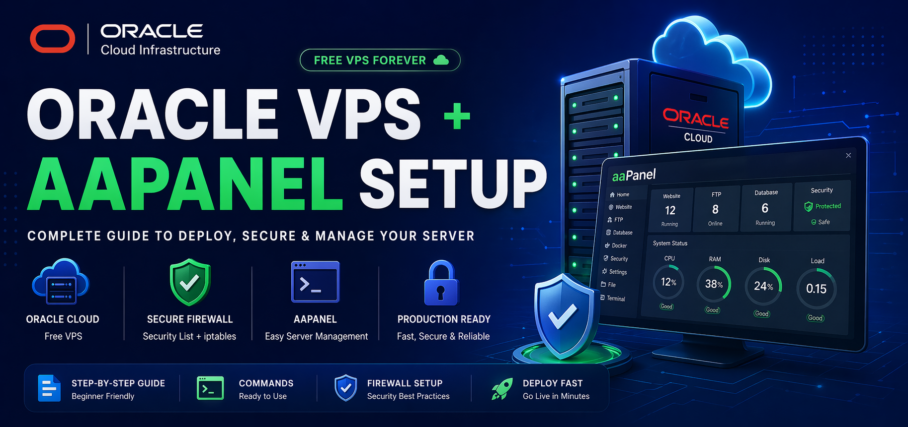

<p align="center">
  
</p>

<p align="center">
  <b>☁️ Oracle VPS + aaPanel Setup Guide</b>
</p>

<h1 align="center">Oracle aaPanel Deployment & Firewall Setup</h1>

<p align="center">
  Free VPS • Secure • Production Ready ⚡<br>
  Developed by <b>Amit Das</b>
</p>

---

## 🚀 Overview

This repository provides a **complete step-by-step guide** to:

* Setup Oracle Free VPS
* Install aaPanel
* Configure Firewall (Security List + iptables)
* Fix panel access issues
* Make your server production-ready

---

## 🌐 Why Oracle Cloud?

Oracle Cloud Free Tier offers:

* 🖥️ Free VPS (AMD / ARM)
* ⚡ High performance
* 🌍 Public IP included
* 💾 Free storage

👉 Perfect for hosting APIs, panels, bots, and websites.

---

## ⚠️ Important Concept (Must Understand)

Oracle Cloud uses **two firewall layers**:

```text
Internet
   ↓
Security List (Subnet Firewall) ❗
   ↓
Server Firewall (iptables / UFW)
   ↓
Application (aaPanel)
```

👉 Opening ports only on server **WILL NOT WORK** ❌
👉 You must open ports in **Security List** ✔

---

## 🔓 Step 1: Open Ports in Security List

Go to:

```
Compute → Instance → Networking
→ Subnet → Security Lists
→ Default Security List
```

---

### ➕ Add Ingress Rules

| Port        | Purpose     |
| ----------- | ----------- |
| 22          | SSH         |
| 80          | HTTP        |
| 443         | HTTPS       |
| 23309       | aaPanel     |
| 8000        | Backend API |
| 888         | phpMyAdmin  |
| 21          | FTP         |
| 30000-40000 | FTP Passive |

---

### ⚡ Quick Debug Rule

```
Port: 1-65535
Source: 0.0.0.0/0
```

> ⚠️ Use only for testing

---

## 🔐 Step 2: Install aaPanel

```bash
URL=https://www.aapanel.com/script/install_panel_en.sh && if [ -f /usr/bin/curl ];then curl -ksSO $URL ;else wget --no-check-certificate -O install_panel_en.sh $URL;fi;bash install_panel_en.sh ipssl
```

---

## 🔗 Step 3: Access Panel

After installation:

```
https://YOUR_IP:23309
```

> ⚠️ Ignore browser SSL warning

---

## 🔧 Step 4: Configure iptables

Edit file:

```bash
sudo nano /etc/iptables/rules.v4
```

---

### ✅ Example Config

```bash
# Generated by iptables-save v1.8.7 on Wed Apr 22 05:18:13 2026
*filter
:INPUT ACCEPT [0:0]
:FORWARD ACCEPT [0:0]
:OUTPUT ACCEPT [156:72841]
:InstanceServices - [0:0]

-A INPUT -m state --state RELATED,ESTABLISHED -j ACCEPT
-A INPUT -p icmp -j ACCEPT
-A INPUT -i lo -j ACCEPT

-A INPUT -p tcp -m state --state NEW -m tcp --dport 2001 -j ACCEPT
-A INPUT -p tcp -m state --state NEW -m tcp --dport 21 -j ACCEPT
-A INPUT -p tcp -m state --state NEW -m tcp --dport 22 -j ACCEPT
-A INPUT -p tcp -m state --state NEW -m tcp --dport 80 -j ACCEPT
-A INPUT -p tcp -m state --state NEW -m tcp --dport 443 -j ACCEPT
-A INPUT -p tcp -m state --state NEW -m tcp --dport 888 -j ACCEPT
-A INPUT -p tcp -m state --state NEW -m tcp --dport 2004 -j ACCEPT
-A INPUT -p tcp -m state --state NEW -m tcp --dport 3306 -j ACCEPT
-A INPUT -p tcp -m state --state NEW -m tcp --dport 5432 -j ACCEPT
-A INPUT -p tcp -m state --state NEW -m tcp --dport 6379 -j ACCEPT
-A INPUT -p tcp -m state --state NEW -m tcp --dport 8000 -j ACCEPT
-A INPUT -p tcp -m state --state NEW -m tcp --dport 23309 -j ACCEPT
-A INPUT -p tcp -m state --state NEW -m tcp --dport 27017 -j ACCEPT
-A INPUT -p tcp -m state --state NEW -m tcp --dport 30000:40000 -j ACCEPT

-A INPUT -j REJECT --reject-with icmp-host-prohibited
-A FORWARD -j REJECT --reject-with icmp-host-prohibited

-A OUTPUT -d 169.254.0.0/16 -j InstanceServices
-A InstanceServices -d 169.254.0.2/32 -p tcp -m owner --uid-owner 0 -m tcp --dport 3260 -m comment --comment "See the Oracle-Provided Images section in the Oracle Cloud Infrastructure documentation for security impact of modifying or removing this rule" -j ACCEPT
-A InstanceServices -d 169.254.2.0/24 -p tcp -m owner --uid-owner 0 -m tcp --dport 3260 -m comment --comment "See the Oracle-Provided Images section in the Oracle Cloud Infrastructure documentation for security impact of modifying or removing this rule" -j ACCEPT
-A InstanceServices -d 169.254.4.0/24 -p tcp -m owner --uid-owner 0 -m tcp --dport 3260 -m comment --comment "See the Oracle-Provided Images section in the Oracle Cloud Infrastructure documentation for security impact of modifying or removing this rule" -j ACCEPT
-A InstanceServices -d 169.254.5.0/24 -p tcp -m owner --uid-owner 0 -m tcp --dport 3260 -m comment --comment "See the Oracle-Provided Images section in the Oracle Cloud Infrastructure documentation for security impact of modifying or removing this rule" -j ACCEPT
-A InstanceServices -d 169.254.0.2/32 -p tcp -m tcp --dport 80 -m comment --comment "See the Oracle-Provided Images section in the Oracle Cloud Infrastructure documentation for security impact of modifying or removing this rule" -j ACCEPT
-A InstanceServices -d 169.254.169.254/32 -p udp -m udp --dport 53 -m comment --comment "See the Oracle-Provided Images section in the Oracle Cloud Infrastructure documentation for security impact of modifying or removing this rule" -j ACCEPT
-A InstanceServices -d 169.254.169.254/32 -p tcp -m tcp --dport 53 -m comment --comment "See the Oracle-Provided Images section in the Oracle Cloud Infrastructure documentation for security impact of modifying or removing this rule" -j ACCEPT
-A InstanceServices -d 169.254.0.3/32 -p tcp -m owner --uid-owner 0 -m tcp --dport 80 -m comment --comment "See the Oracle-Provided Images section in the Oracle Cloud Infrastructure documentation for security impact of modifying or removing this rule" -j ACCEPT
-A InstanceServices -d 169.254.0.4/32 -p tcp -m tcp --dport 80 -m comment --comment "See the Oracle-Provided Images section in the Oracle Cloud Infrastructure documentation for security impact of modifying or removing this rule" -j ACCEPT
-A InstanceServices -d 169.254.169.254/32 -p tcp -m tcp --dport 80 -m comment --comment "See the Oracle-Provided Images section in the Oracle Cloud Infrastructure documentation for security impact of modifying or removing this rule" -j ACCEPT
-A InstanceServices -d 169.254.169.254/32 -p udp -m udp --dport 67 -m comment --comment "See the Oracle-Provided Images section in the Oracle Cloud Infrastructure documentation for security impact of modifying or removing this rule" -j ACCEPT
-A InstanceServices -d 169.254.169.254/32 -p udp -m udp --dport 69 -m comment --comment "See the Oracle-Provided Images section in the Oracle Cloud Infrastructure documentation for security impact of modifying or removing this rule" -j ACCEPT
-A InstanceServices -d 169.254.169.254/32 -p udp -m udp --dport 123 -m comment --comment "See the Oracle-Provided Images section in the Oracle Cloud Infrastructure documentation for security impact of modifying or removing this rule" -j ACCEPT
-A InstanceServices -d 169.254.0.0/16 -p tcp -m tcp -m comment --comment "See the Oracle-Provided Images section in the Oracle Cloud Infrastructure documentation for security impact of modifying or removing this rule" -j REJECT --reject-with tcp-reset
-A InstanceServices -d 169.254.0.0/16 -p udp -m udp -m comment --comment "See the Oracle-Provided Images section in the Oracle Cloud Infrastructure documentation for security impact of modifying or removing this rule" -j REJECT --reject-with icmp-port-unreachable

COMMIT
```

---

## 🚀 Apply Firewall Rules

```bash
sudo iptables-restore < /etc/iptables/rules.v4
sudo netfilter-persistent save
```

---

## 🧪 Verification

```bash
bt status
```

```bash
netstat -tulnp | grep 23309
```

---

## ❌ Common Issues

| Problem            | Reason                       |
| ------------------ | ---------------------------- |
| Panel not opening  | Security List not configured |
| Timeout error      | Subnet not connected         |
| Connection refused | Panel not running            |

---

## 🔐 Security Warning

Avoid exposing these publicly:

* ❌ MongoDB (27017)
* ❌ Redis (6379)
* ❌ PostgreSQL (5432)

👉 Restrict them to your IP for production use.

---

## 🎯 Final Checklist

✔ aaPanel installed
✔ Security List configured
✔ iptables applied
✔ Panel running
✔ Correct URL used

---

## 💡 Pro Tips

Change panel port:

```bash
bt 8
```

Use domain + SSL for better security.

---

## 📬 Support

<p align="center">
  <a href="https://t.me/BlueOrbitDevs">
    
  </a>
</p>

---

## 📜 License

MIT License © 2026 Amit Das

---

<p align="center">
  <b>Deploy Smart • Secure Fast 🚀</b>
</p>
